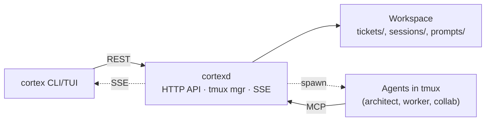

# Cortex

[](https://github.com/kareemaly/cortex/releases/latest)

**A persistent workspace for multi-repo AI development.**

You work across many repos — five, ten, twenty, in one domain. AI coding agents work inside one repo; they don't see the others. Your planning lives in Jira, your design notes in Notion or Confluence, your last session's state in your head. None of it is where the code is.

## The model

Cortex splits the work across two tiers.

The **architect** is a persistent workspace — a directory separate from any repo — where you brainstorm, write design docs, and manage tickets.

**Worker** agents are spawned from the architect. Each ticket targets exactly one repo. The worker runs in a scoped tmux session, implements the ticket, and writes a **conclusion** when done.

Every session — architect or worker — ends with a conclusion on disk. When you start a new architect session, it reads the previous one first, so prior context is already loaded.

## Just markdown

Inside the workspace, tickets and conclusions are markdown files with YAML frontmatter: tickets in `tickets/{backlog,progress,done}/`, conclusions in `sessions/`. No database, no proprietary format.

Uninstall Cortex and the workspace directory stays as-is. The markdown is readable and editable with any tool.

## Accumulated context

After a few months of regular use you have hundreds of tickets and conclusions. The architect has a `search` MCP tool that scans every ticket (backlog, in-progress, done) and every conclusion.

Ask "what did we do on feature X?" and it returns the related tickets across every repo and their conclusions — commit SHAs, design notes, follow-ups. A single architect conclusion routinely covers a multi-ticket, multi-repo feature rollout.

## Who this is for

Cortex is built for engineers who live in the terminal. Every agent runs in a tmux window next to a companion pane — the kanban TUI for the architect, a configurable pane (lazygit, nvim, a shell) for workers and collab.


*Architect session — agent on the left, Cortex's kanban / sessions / config TUI on the right.*


*Worker session — agent on the left, lazygit and a diff viewer on the right.*

## Requirements

- **tmux**
- **git**
- **An AI agent runtime** — Claude Code, Codex, or OpenCode
- **Go 1.21+** (only for building from source)
- Linux or macOS

## Quickstart

Install:

```bash
curl -fsSL https://github.com/kareemaly/cortex/releases/latest/download/install.sh | bash
```

Create a new architect workspace:

```bash
cortex init myproject
cd myproject
```

Edit `cortex.yaml` to point at your repos:

```yaml
name: myproject
repos:
  - ~/projects/my-service
  - ~/projects/my-other-service
```

Start the architect:

```bash
cortex architect start
```

This attaches you to a tmux session with the architect agent on the left and the kanban TUI on the right. The daemon auto-starts on first invocation. From there, work with the architect — brainstorm, draft tickets, spawn workers.

## Commands

| Command | Description |
|---------|-------------|
| `cortex init <name>` | Initialize a new architect workspace |
| `cortex architect start [name]` | Start or attach to an architect session |
| `cortex architect list` | List registered architects |
| `cortex architect show [name]` | Open the project TUI (kanban / sessions / config) |
| `cortex daemon status` | Check daemon status |
| `cortex upgrade` | Refresh embedded defaults |
| `cortex eject <path>` | Customize a default prompt |

## Configuration

### `cortex.yaml`

```yaml
name: myproject

# Repos this architect manages. Workers spawn inside these paths.
repos:
  - ~/projects/service-a
  - ~/projects/service-b

# Companion pane for workers and collab sessions.
# The architect always shows the Cortex TUI (kanban / sessions / config).
companion: lazygit

# Agent variants. Project variants override global ones by name.
# Valid agent values: claude, opencode, codex.
agents:
  claude-opus:
    agent: claude
    args: ["--permission-mode", "auto"]
  claude-opus-plan:
    agent: claude
    args: ["--permission-mode", "plan"]
  codex:
    agent: codex
    args: ["--full-auto"]
  codex-plan:
    agent: codex
    args: ["--sandbox", "read-only", "--ask-for-approval", "never"]
  opencode:
    agent: opencode
  opencode-plan:
    agent: opencode
    args: ["--agent", "plan"]
```

Defaults are generated during `cortex init` based on which agents (`claude`, `codex`, `opencode`) are on your `PATH`. They live in `~/.cortex/settings.yaml` and apply to every architect unless overridden.

### Global settings

`~/.cortex/settings.yaml` holds the daemon config:

```yaml
port: 4200
bind_address: 127.0.0.1  # set to 0.0.0.0 to expose the daemon to other machines
```

Clients find the daemon via `CORTEX_DAEMON_URL` (default `http://localhost:4200`) — set this when running `cortex` commands against a remote daemon.

## Customizing prompts

Cortex ships default prompts that drive the architect and worker agents. Two files per role:

- `SYSTEM.md` — the agent's system prompt. For the architect this fully replaces the agent's default system prompt; for workers it's appended.
- `KICKOFF.md` — the first message the agent sees. Rendered with context: the architect's `KICKOFF.md` gets the ticket list, recent conclusions, and repos; the worker's gets the ticket body, references, and repo path.

To customize, eject the default into your workspace:

```bash
cortex eject architect/SYSTEM.md
cortex eject architect/KICKOFF.md
cortex eject work/KICKOFF.md
```

Ejected prompts live in `prompts/` inside your architect workspace and take precedence over the defaults. Delete the file to fall back.

## Architecture

A single `cortexd` daemon serves every architect workspace on your machine. The CLI/TUI and every agent talk to it over HTTP — clients use the REST API, agents use MCP tools. All state lives on disk in the workspace.



The daemon is one binary. Because everything is HTTP, you can run `cortexd` on a remote VM and point your local `cortex` CLI at it with `CORTEX_DAEMON_URL`.

See [CLAUDE.md](CLAUDE.md) for architecture details and code paths.

## Development

Build from source:

```bash
git clone https://github.com/kareemaly/cortex.git
cd cortex
make build   # produces bin/cortex and bin/cortexd
```

Install to `~/.local/bin`:

```bash
make install
```

Tests and lint:

```bash
make test
make lint
```

See [CONTRIBUTING.md](CONTRIBUTING.md) for the full workflow.

## License

MIT
