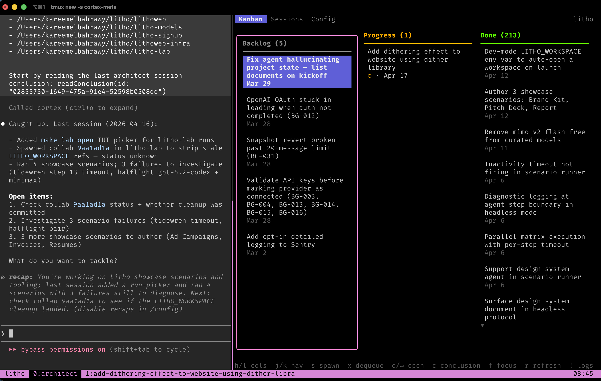
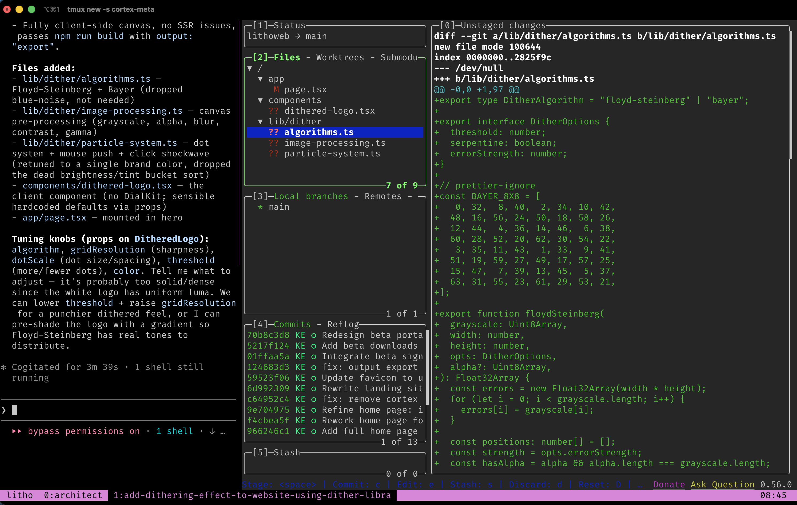
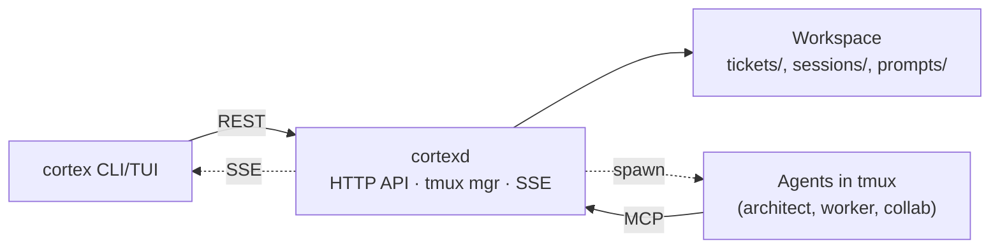

# Cortex

[](https://github.com/kareemaly/cortex/releases/latest)

Cortex is a terminal-native workspace for AI-assisted software engineering across multiple repos.

It gives you:

- a persistent **architect workspace** for project memory, notes, specs, tickets, and session conclusions
- repo-scoped **worker sessions** that spawn directly into the right codebase with the right context
- a file-based system that keeps project state on disk instead of trapped in chat history

If you work across several repos, Cortex keeps the planning thread in one place and sends implementation work to scoped agents in the correct repo.


*Architect session - agent on the left, Cortex project UI on the right.*

## What Cortex Actually Is

Cortex combines a few things into one workflow:

- a dedicated project workspace, separate from your source repos
- a long-lived **architect** session for planning, research, and coordination
- scoped **worker** sessions for ticketed repo work
- optional **collab** sessions for ticketless repo investigations or hotfixes
- a single `cortexd` daemon that manages tmux sessions, HTTP APIs, and MCP tools

This is not just a ticket format and not just a CLI wrapper around agent runtimes. It is a persistent control plane for multi-repo engineering work.

## Mental Model

Cortex has three session types:

- **Architect**: the long-lived session where you plan, review backlog, write tickets, keep notes, and coordinate work across repos
- **Worker**: a ticket-backed session spawned into a specific repo to implement changes
- **Collab**: a ticketless repo session for ad hoc debugging, investigation, or one-off work

The architect workspace is where Cortex stores and grows project context over time. In practice, that often includes:

- tickets and conclusions
- architecture notes and specs
- findings from investigations
- scratch scripts and generated artifacts
- prompts and local workflow conventions

## How It Works

1. Create an architect workspace.
   This is the durable home for the project, separate from the repos it manages.

2. Start the architect session.
   Cortex opens a tmux session with your architect agent on the left and the Cortex TUI on the right.

3. Create or select a ticket.
   The architect writes lightweight markdown tickets grounded in the workspace context.

4. Spawn a worker.
   Cortex opens a new tmux window inside the target repo, injects the ticket context, and starts the worker immediately.

5. Review and conclude.
   When work is done, the worker records a conclusion, the ticket state advances, and the architect keeps the broader thread intact.

## Why Use It

Without Cortex, multi-repo agent work usually means:

- re-explaining context every time you open a new session
- mixing planning notes with implementation threads
- losing state between chats
- manually routing work to the right repo and model

Cortex gives you:

- persistent project memory across sessions
- clear separation between planning and implementation
- repo-scoped execution instead of one giant shared context
- markdown tickets and conclusions that remain useful without Cortex
- per-session model selection across Claude, Codex, and OpenCode variants

## A Day With Cortex

You `cd` into your architect workspace and run `cortex architect start`. Cortex attaches you to a tmux window: the architect agent on the left, the project TUI on the right. The architect already has the current ticket state, configured repos, and recent conclusions, so the session resumes from the last meaningful checkpoint instead of from zero.

You spend time here doing the work that does not belong in any single source repo yet: exploring the problem, writing notes, drafting specs, capturing findings, and shaping tickets. This workspace becomes the durable memory of the project.

When a task is concrete enough, you create or refine a ticket and spawn a worker. Cortex opens a new tmux window in the repo that owns the work. The worker already knows which architect it belongs to, which repo it is in, the ticket body, and any referenced tickets.

While workers run, you stay with the architect and continue planning, researching, or drafting the next piece. The TUI shows live ticket/session state. When a worker finishes, you review the diff in the companion pane, test or push as needed, and tell the worker to conclude the session. Cortex records the conclusion and closes the window.

For work that does not deserve a ticket, you can spawn a collab session at any path. A collab is still part of the same Cortex operating model: it has its own conclusion, can create tickets if the investigation turns into real work, and keeps the architect workspace as the top-level coordination layer.

## Worker Sessions

A worker session is a repo-scoped tmux window. The agent works on the left; the companion pane on the right can be `lazygit` or another repo tool.


*Worker session - agent on the left, repo companion pane on the right.*

## Markdown On Disk

Tickets live in `tickets/{backlog,progress,done}/`, conclusions in `sessions/`. Each is a markdown file with YAML frontmatter - no database, no proprietary format. The workspace can also hold whatever supporting material your project needs: notes, specs, findings, workbench experiments, prompts, and generated artifacts.

Uninstall Cortex and you do not lose your project history. The workspace remains readable on disk, and any coding agent can still inspect it.

## Mixing Models

Each spawn picks an **agent variant** - a named runtime + flags combination, defined in [`cortex.yaml`](#cortexyaml) or `~/.cortex/settings.yaml`. On first `cortex init`, defaults are seeded for any of Claude / Codex / OpenCode on your `PATH`, each with a `-plan` sibling. Pick per spawn, so your Claude and OpenAI subscriptions do not compete for the same session model.

## Requirements

- **tmux**
- **git**
- **An AI agent runtime** - Claude Code, Codex, or OpenCode
- **Go 1.21+** (only for building from source)
- Linux or macOS

## Quickstart

Install:

```bash
curl -fsSL https://github.com/kareemaly/cortex/releases/latest/download/install.sh | bash
```

Create a new architect workspace:

```bash
cortex init myproject
cd myproject
```

`cortex init` creates a starter `cortex.yaml`. Edit it to point at the repos Cortex should manage:

```yaml
name: myproject
repos:
  - ~/projects/my-service
  - ~/projects/my-other-service
```

Start the architect:

```bash
cortex architect start
```

This attaches you to a tmux session with the architect agent on the left and the Cortex TUI on the right. From there, you can write notes, create tickets, inspect recent conclusions, and spawn workers into the configured repos.

## Commands

| Command | Description |
|---------|-------------|
| `cortex init <name>` | Initialize a new architect workspace |
| `cortex architect start [name]` | Start or attach to an architect session |
| `cortex architect list` | List registered architects |
| `cortex architect show [name]` | Open the project TUI (kanban / sessions / config) |
| `cortex dashboard` | Open the global dashboard across all registered architects |
| `cortex daemon status` | Check daemon status |
| `cortex upgrade` | Refresh embedded defaults |
| `cortex eject <path>` | Customize a default prompt |

## Configuration

### `cortex.yaml`

```yaml
name: myproject

# Repos this architect manages. Workers spawn inside these paths.
repos:
  - ~/projects/service-a
  - ~/projects/service-b

# Companion pane for workers and collab sessions.
# The architect always shows the Cortex TUI (kanban / sessions / config).
companion: lazygit

# Optional: project-only variants, or overrides for the global ones in
# ~/.cortex/settings.yaml. Same schema; project values win on name match.
# Valid agent values: claude, opencode, codex.
agents:
  claude-plan:
    agent: claude
    args: ["--permission-mode", "plan"]
```

### Global settings

`~/.cortex/settings.yaml` holds the daemon config:

```yaml
port: 4200
bind_address: 127.0.0.1  # set to 0.0.0.0 to expose the daemon to other machines
```

`cortex init` also seeds an `agents:` map here (same schema as `cortex.yaml` above) - one variant + a `-plan` sibling for each of Claude / Codex / OpenCode on your `PATH`. Edit it to add or tweak variants; project `cortex.yaml` values override by name.

Clients find the daemon via `CORTEX_DAEMON_URL` (default `http://localhost:4200`) - set this when running `cortex` commands against a remote daemon.

## Customizing Prompts

Cortex ships default prompts for the architect and worker agents:

- [`architect/SYSTEM.md`](internal/install/defaults/main/prompts/architect/SYSTEM.md) - fully replaces the agent's system prompt for the architect session
- [`architect/KICKOFF.md`](internal/install/defaults/main/prompts/architect/KICKOFF.md) - first message sent to the architect, rendered with the ticket list, recent conclusions, and repos
- [`work/KICKOFF.md`](internal/install/defaults/main/prompts/work/KICKOFF.md) - first message sent to each worker, rendered with the ticket body, references, and repo path

Only the architect has a `SYSTEM.md`. Workers rely on the kickoff prompt alone; collab sessions have no template - the architect crafts each one's prompt live.

To customize, eject the default into your workspace:

```bash
cortex eject architect/SYSTEM.md
cortex eject architect/KICKOFF.md
cortex eject work/KICKOFF.md
```

Ejected prompts live in `prompts/` inside your architect workspace and take precedence over the defaults. Delete the file to fall back.

## MCP Tools

The full MCP API each role can call. The common user-facing phrases are things like "spawn this ticket", "create a ticket", "search tickets", and "conclude cortex session". This table is the complete reference, with access per role (Architect / Worker / Collab):

| Tool | A | W | C | Parameters |
|------|---|---|---|------------|
| `listTickets` | ✓ | | | `status` (req: backlog/progress/done), `query` |
| `readTicket` | ✓ | ✓ | | `id` (req) |
| `createWorkTicket` | ✓ | | ✓ | `title` (req), `repo` (req), `body`, `due_date` (RFC3339), `references` |
| `updateTicket` | ✓ | | ✓ | `id` (req); any of `title`, `body`, `references` |
| `deleteTicket` | ✓ | | | `id` (req) |
| `moveTicket` | ✓ | | | `id` (req), `status` (req) |
| `updateDueDate` | ✓ | | | `id` (req), `due_date` (req: RFC3339) |
| `clearDueDate` | ✓ | | | `id` (req) |
| `listVariants` | ✓ | | | - |
| `spawnSession` | ✓ | | | `ticket_id` (req), `variant` (req), `mode` (normal/resume/fresh) |
| `spawnCollabSession` | ✓ | | | `path` (req, must exist), `prompt` (req), `variant` (req) |
| `listConclusions` | ✓ | | | `type` (architect/work/collab), `limit` (default 10), `offset` |
| `readConclusion` | ✓ | | | `id` (req) |
| `search` | ✓ | | | `query` (req), `limit` (default 25) |
| `concludeSession` | ✓ | ✓ | ✓ | `body` (req). Worker: `commits` required unless `rejected=true` + `rejection_reason`. Collab: `commits` optional. |

## Architecture

A single `cortexd` daemon serves every architect workspace on your machine. The CLI/TUI and every agent talk to it over HTTP - clients use the REST API, agents use MCP tools. All durable state lives on disk in the workspace.



Because everything is HTTP, you can run `cortexd` on a remote VM and point your local `cortex` CLI at it with `CORTEX_DAEMON_URL`.

See [AGENTS.md](AGENTS.md) for architecture details and code paths.

## Development

Build from source:

```bash
git clone https://github.com/kareemaly/cortex.git
cd cortex
make build   # produces bin/cortex and bin/cortexd
```

Install to `~/.local/bin`:

```bash
make install
```

Tests and lint:

```bash
make test
make lint
```

See [CONTRIBUTING.md](CONTRIBUTING.md) for the full workflow.

## License

MIT
