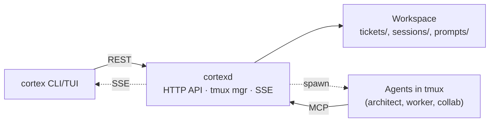

# Cortex

[](https://github.com/kareemaly/cortex/releases/latest)

You work across five or ten repos in one domain. AI coding agents are scoped to one repo and blind to the others. You become the router — between sessions, between repos, between subscriptions — holding state in your head and re-explaining context every time you open a new chat.

Cortex splits that job in two: a persistent workspace where you plan, and scoped workers that take each ticket into the right repo.

## A day with Cortex

You `cd` into your architect workspace and run `cortex architect start`. It attaches you to a tmux window: the architect agent on the left, a kanban TUI on the right. The architect already knows the current kanban, the repos it works across, and yesterday's conclusion — so the planning thread picks up where you left off.


*Architect session — agent on the left, Cortex's kanban TUI on the right.*

You spend the morning here, with the architect — researching, sketching ideas, writing notes. None of it lives in any repo. Once the plan is concrete, you draft tickets, each lean but grounded in the artifacts you just wrote.

When you're ready to ship a ticket, you tell the architect *"spawn this ticket with claude-sonnet"* — or hit `s` on the kanban TUI. A new tmux window opens with the worker agent on the left and a companion pane (lazygit by default) on the right. The agent starts immediately: it already knows which architect it's under, which repo it lives in, the sibling repos in the ecosystem, the ticket body, and any referenced tickets — no setup prompt from you.


*Worker session — agent on the left, lazygit on the right.*

While workers run across your repos, you stay in the architect, planning the next piece. The kanban shows live status for every session. When you notice a worker has gone idle — usually waiting on you — you switch to its window, answer the question or approve the plan, and let it continue. When the work is done, you review the diff in the companion pane, push, and test. Then you tell the worker *"conclude cortex session"*. It writes a conclusion (what shipped, what was decided, what was rejected and why), the tmux window closes, and the kanban flips the ticket to done.

For work that doesn't warrant a ticket — a hotfix, a spike, a quick investigation — you tell the architect *"spawn a collab in ~/projects/some-repo to look at X"*. A **collab** is a ticketless worker that runs at any path you give it, writes its own conclusion, and can create tickets mid-session if something real surfaces.

At end of day, your last message to the architect is *"conclude cortex session, leave a note for tomorrow to continue X, Y, Z"*. It writes the conclusion and the tmux window closes. Tomorrow morning you run `cortex architect start` from the workspace again and the thread resumes.

### Steering prompts

| Role | When you say… | The agent calls |
|------|---------------|-----------------|
| Architect | "spawn this ticket with variant X" | `spawnSession` |
| | "spawn a collab in ~/projects/foo to investigate Y" | `spawnCollabSession` |
| | "ticket X is done, read it" | `readTicket` (with nested conclusion) |
| | "search tickets for Y" | `search` |
| | "create a ticket for Z" | `createWorkTicket` |
| | "show me available variants" | `listVariants` |
| | "conclude cortex session" | `concludeSession` |
| Worker | "conclude cortex session" | `concludeSession` (commits required, or `rejected=true` + reason) |
| Collab | "create a ticket for …" | `createWorkTicket` |
| | "conclude cortex session" | `concludeSession` (commits optional) |

## Markdown on disk

Tickets live in `tickets/{backlog,progress,done}/`, conclusions in `sessions/`. Each is a markdown file with YAML frontmatter — no database, no proprietary format. After a few months of regular use you have hundreds of each; the architect's `search` tool scans all of them when you ask "what did we do on feature X?"

Uninstall Cortex and you don't lose anything. The tickets and conclusions stay on disk — point any coding agent at the workspace and it can still read and search them.

## Mixing models

Each spawn picks an **agent variant** — a named runtime + flags combination, defined in [`cortex.yaml`](#cortexyaml) or `~/.cortex/settings.yaml`. On first `cortex init`, defaults are seeded for any of Claude / Codex / OpenCode on your `PATH`, each with a `-plan` sibling. Pick per spawn — your Claude and OpenAI subscriptions stop competing.

## Requirements

- **tmux**
- **git**
- **An AI agent runtime** — Claude Code, Codex, or OpenCode
- **Go 1.21+** (only for building from source)
- Linux or macOS

## Quickstart

Install:

```bash
curl -fsSL https://github.com/kareemaly/cortex/releases/latest/download/install.sh | bash
```

Create a new architect workspace:

```bash
cortex init myproject
cd myproject
```

`cortex init` created a starter `cortex.yaml`. Edit it to point at your repos:

```yaml
name: myproject
repos:
  - ~/projects/my-service
  - ~/projects/my-other-service
```

Start the architect:

```bash
cortex architect start
```

This attaches you to a tmux session with the architect agent on the left and the kanban TUI on the right. The daemon auto-starts on first invocation. From there, work with the architect — brainstorm, draft tickets, spawn workers.

## Commands

| Command | Description |
|---------|-------------|
| `cortex init <name>` | Initialize a new architect workspace |
| `cortex architect start [name]` | Start or attach to an architect session |
| `cortex architect list` | List registered architects |
| `cortex architect show [name]` | Open the project TUI (kanban / sessions / config) |
| `cortex dashboard` | Open the global dashboard across all registered architects |
| `cortex daemon status` | Check daemon status |
| `cortex upgrade` | Refresh embedded defaults |
| `cortex eject <path>` | Customize a default prompt |

## Configuration

### `cortex.yaml`

```yaml
name: myproject

# Repos this architect manages. Workers spawn inside these paths.
repos:
  - ~/projects/service-a
  - ~/projects/service-b

# Companion pane for workers and collab sessions.
# The architect always shows the Cortex TUI (kanban / sessions / config).
companion: lazygit

# Optional: project-only variants, or overrides for the global ones in
# ~/.cortex/settings.yaml. Same schema; project values win on name match.
# Valid agent values: claude, opencode, codex.
agents:
  claude-strict:
    agent: claude
    args: ["--permission-mode", "plan"]
```

### Global settings

`~/.cortex/settings.yaml` holds the daemon config:

```yaml
port: 4200
bind_address: 127.0.0.1  # set to 0.0.0.0 to expose the daemon to other machines
```

`cortex init` also seeds an `agents:` map here (same schema as `cortex.yaml` above) — one variant + a `-plan` sibling for each of Claude / Codex / OpenCode on your `PATH`. Edit it to add or tweak variants; project `cortex.yaml` values override by name.

Clients find the daemon via `CORTEX_DAEMON_URL` (default `http://localhost:4200`) — set this when running `cortex` commands against a remote daemon.

## Customizing prompts

Cortex ships default prompts for the architect and worker agents:

- [`architect/SYSTEM.md`](internal/install/defaults/main/prompts/architect/SYSTEM.md) — fully replaces the agent's system prompt for the architect session.
- [`architect/KICKOFF.md`](internal/install/defaults/main/prompts/architect/KICKOFF.md) — first message sent to the architect, rendered with the ticket list, recent conclusions, and repos.
- [`work/KICKOFF.md`](internal/install/defaults/main/prompts/work/KICKOFF.md) — first message sent to each worker, rendered with the ticket body, references, and repo path.

Only the architect has a `SYSTEM.md`. Workers rely on the kickoff prompt alone; collab sessions have no template — the architect crafts each one's prompt live.

To customize, eject the default into your workspace:

```bash
cortex eject architect/SYSTEM.md
cortex eject architect/KICKOFF.md
cortex eject work/KICKOFF.md
```

Ejected prompts live in `prompts/` inside your architect workspace and take precedence over the defaults. Delete the file to fall back.

## Architecture

A single `cortexd` daemon serves every architect workspace on your machine. The CLI/TUI and every agent talk to it over HTTP — clients use the REST API, agents use MCP tools. All state lives on disk in the workspace.



The daemon is one binary. Because everything is HTTP, you can run `cortexd` on a remote VM and point your local `cortex` CLI at it with `CORTEX_DAEMON_URL`.

See [CLAUDE.md](CLAUDE.md) for architecture details and code paths.

## Development

Build from source:

```bash
git clone https://github.com/kareemaly/cortex.git
cd cortex
make build   # produces bin/cortex and bin/cortexd
```

Install to `~/.local/bin`:

```bash
make install
```

Tests and lint:

```bash
make test
make lint
```

See [CONTRIBUTING.md](CONTRIBUTING.md) for the full workflow.

## License

MIT
